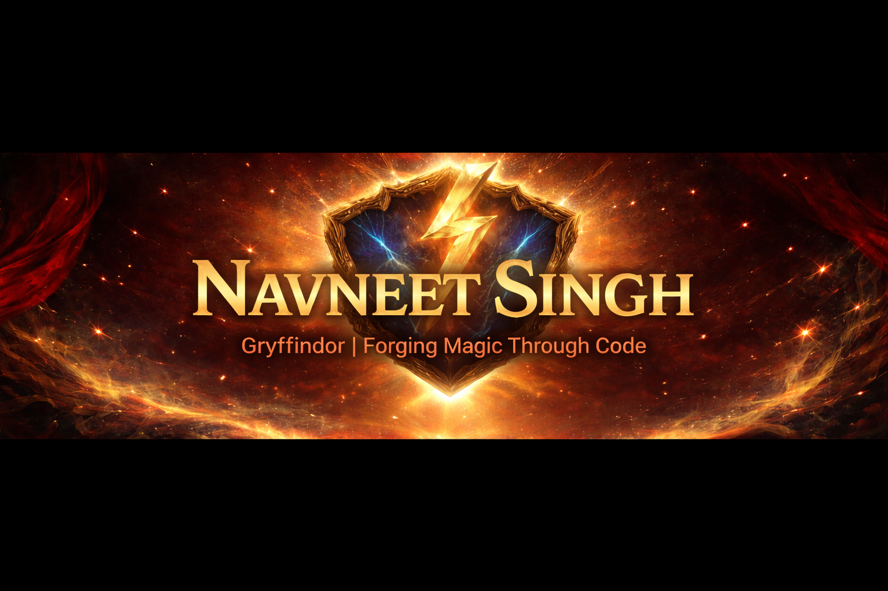

  

  

  

✨ ─────────────── ⚡ MAGIC BARRIER ⚡ ─────────────── ✨

# 📜 Gryffindor Scroll of Identity

**🧙‍♂️ Name:** Navneet Singh  
**🏰 House:** Gryffindor  
**🌍 Origin:** India  
**🪄 GitHub Alias:** `navneat-codes`  
**📜 Status:** Active Learner  

**🎓 University:** Ajeenkya DY Patil University  
**📖 Degree:** B.Tech  
**🧠 Discipline:** Computer Science & Engineering (AI)

**⚔️ Traits:** Courageous • Curious • Persistent  
**🛤️ Path:** Open Source • Full Stack • Systems

> ### 🦁 Gryffindor Creed
> *“It takes a great deal of bravery to stand up to bugs, but just as much to stand up to your own code.”*

 

✨ ─────────────── ⚡ MAGIC BARRIER ⚡ ─────────────── ✨

# 🔥 Wizarding Network

# ⚔️ Wizard Training

📖 Mastering **Data Structures & Algorithms**  
🪄 Learning **Django & Backend Systems**  
⚡ Exploring **Open Source Contributions**  
🏗️ Building **Full Stack Applications**

---

# 📚 Spellbook of Mastery
### 🪄 Arcane Technologies I Practice

## 🧠 Core Languages

<table align="center">
<tr>

<td align="center" width="120">
 
<b>Java</b>
</td>

<td align="center" width="120">
 
<b>Python</b>
</td>

<td align="center" width="120">
 
<b>JavaScript</b>
</td>

</tr>
</table>

---

## 🎨 Frontend Enchantments

<table align="center">
<tr>

<td align="center" width="120">
 
<b>HTML</b>
</td>

<td align="center" width="120">
 
<b>CSS</b>
</td>

<td align="center" width="120">
 
<b>React</b>
</td>

<td align="center" width="120">
 
<b>Next.js</b>
</td>

</tr>
</table>

---

## 🏰 Backend & Ancient Tomes

<table align="center">
<tr>

<td align="center" width="120">
 
<b>Django</b>
</td>

<td align="center" width="120">
 
<b>Node.js</b>
</td>

<td align="center" width="120">
 
<b>PostgreSQL</b>
</td>

</tr>
</table>

---

## 🧪 Tools & Potions

<table align="center">
<tr>

<td align="center" width="120">
 
<b>Git</b>
</td>

<td align="center" width="120">
 
<b>Docker</b>
</td>

</tr>
</table>

---

# 📊 Gryffindor Activity Chronicle

 

---

# 🐍 Basilisk Devours My Commits

> *"The Basilisk awakens… and devours every commit in its path."*

---

# 🏰 Wisdom from the Great Hall

> **🧙‍♂️ Albus Dumbledore**  
> *“It is our choices, far more than our abilities, that define our codebases.”*

> **⚡ Harry Potter**  
> *“Working code isn’t born brave — it becomes brave when you push it.”*

> **📚 Hermione Granger**  
> *“Before attempting magic, consult the documentation.”*

> **🧣 Ron Weasley**  
> *“If it compiled once, don’t touch it.”*

> **🖤 Severus Snape**  
> *“Control your variables. Discipline your logic.”*

---

# ⚡ The Beginning of the Legend

🕯️ The spells will sharpen.  
📚 The knowledge will deepen.  
🔥 The courage will compound.

**This is not the highlight.  
This is the prologue.**

— **Mischief Managed 🦁✨**

